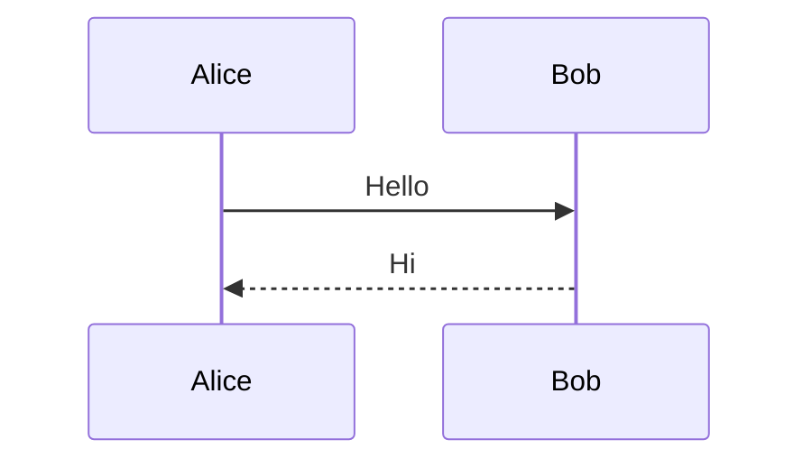

# md2doc 实施计划

> **For agentic workers:** REQUIRED SUB-SKILL: Use superpowers:subagent-driven-development (recommended) or superpowers:executing-plans to implement this plan task-by-task. Steps use checkbox (`- [ ]`) syntax for tracking.

**Goal:** 构建一个名为 `md2doc` 的命令行工具，把 Markdown 转换为 .docx 等多种格式，支持 mermaid 图表预处理。

**Architecture:** Python CLI（click + rich），编排两个外部工具：pandoc（文档转换）和 mmdc（mermaid 渲染）。模块按职责分离，外部交互集中在 `pandoc.py` 和 `mermaid.py` 两个边界模块，便于测试时 mock。

**Tech Stack:** Python 3.9+、click（CLI）、rich（输出）、pandoc（外部）、@mermaid-js/mermaid-cli（外部）、pytest（测试）、ruff（lint）

**Spec:** `docs/superpowers/specs/2026-08-08-md2doc-design.md`

---

## 文件结构

```
md2doc/
├── pyproject.toml                  # 项目元数据 + 依赖 + 入口点
├── README.md                       # 用户文档
├── src/
│   └── md2doc/
│       ├── __init__.py             # 包标记 + 版本号
│       ├── __main__.py             # 支持 python -m md2doc
│       ├── cli.py                  # click 命令定义、参数解析、退出码
│       ├── converter.py            # 业务编排：扫描输入→预处理→pandoc→输出
│       ├── pandoc.py               # pandoc 检测、版本查询、调用封装
│       ├── mermaid.py              # mermaid 提取、渲染(mmdc)、代码块替换
│       └── errors.py               # 自定义异常层级
└── tests/
    ├── __init__.py
    ├── conftest.py                 # 共享 fixtures（临时目录等）
    ├── test_errors.py
    ├── test_mermaid.py
    ├── test_pandoc.py
    ├── test_converter.py
    ├── test_cli.py
    └── fixtures/
        ├── simple.md
        ├── with_mermaid.md
        ├── multi_mermaid.md
        ├── invalid_mermaid.md
        └── batch/
            ├── a.md
            ├── c.md
            └── sub/
                └── b.md
```

**模块职责：**
- `errors.py` — 异常层级（带 exit_code），无依赖
- `pandoc.py` — 唯一与 pandoc 交互的模块
- `mermaid.py` — 唯一与 mmdc 交互的模块
- `converter.py` — 编排上述两个模块，处理路径解析、批量收集
- `cli.py` — click 命令，调用 converter，格式化输出
- `__main__.py` — 仅 `from md2doc.cli import main; main()`

**实施顺序（依赖从低到高）：** errors → pandoc → mermaid → converter → cli → pyproject 入口点 → README。

---

## Task 1: 项目骨架与 errors 模块

**Files:**
- Create: `pyproject.toml`
- Create: `src/md2doc/__init__.py`
- Create: `src/md2doc/errors.py`
- Create: `tests/__init__.py`
- Create: `tests/test_errors.py`

- [ ] **Step 1: 创建 pyproject.toml**

```toml
[build-system]
requires = ["hatchling"]
build-backend = "hatchling.build"

[project]
name = "md2doc"
version = "0.1.0"
description = "把 Markdown 转换为 Word/PDF/HTML/EPUB，支持 mermaid 图表"
requires-python = ">=3.9"
dependencies = [
    "click>=8.1",
    "rich>=13.0",
]

[project.optional-dependencies]
dev = [
    "pytest>=8.0",
    "pytest-cov",
    "ruff",
]

[project.scripts]
md2doc = "md2doc.cli:main"

[tool.hatch.build.targets.wheel]
packages = ["src/md2doc"]

[tool.pytest.ini_options]
testpaths = ["tests"]
pythonpath = ["src"]

[tool.ruff]
line-length = 100
target-version = "py39"
```

- [ ] **Step 2: 创建包标记文件**

`src/md2doc/__init__.py`:
```python
"""md2doc: Markdown 到 Word/PDF/HTML/EPUB 的命令行转换工具。"""

__version__ = "0.1.0"
```

- [ ] **Step 3: 写失败的测试（errors 模块）**

`tests/test_errors.py`:
```python
import pytest
from md2doc.errors import (
    Md2docError,
    InvalidInputError,
    DependencyNotFoundError,
    PandocNotFoundError,
    MmdcNotFoundError,
    ConversionError,
)


def test_base_error_exit_code_is_4():
    assert Md2docError("msg").exit_code == 4


def test_invalid_input_error_exit_code_is_2():
    assert InvalidInputError("msg").exit_code == 2


def test_dependency_not_found_exit_code_is_3():
    assert DependencyNotFoundError("msg").exit_code == 3


def test_pandoc_not_found_is_dependency_subclass():
    err = PandocNotFoundError("missing")
    assert err.exit_code == 3
    assert isinstance(err, DependencyNotFoundError)
    assert isinstance(err, Md2docError)


def test_mmdc_not_found_is_dependency_subclass():
    err = MmdcNotFoundError("missing")
    assert err.exit_code == 3
    assert isinstance(err, DependencyNotFoundError)


def test_conversion_error_exit_code_is_4():
    assert ConversionError("msg").exit_code == 4


def test_all_errors_inherit_from_md2doc_error():
    for cls in [
        InvalidInputError,
        DependencyNotFoundError,
        PandocNotFoundError,
        MmdcNotFoundError,
        ConversionError,
    ]:
        assert issubclass(cls, Md2docError)
```

- [ ] **Step 4: 运行测试验证失败**

Run: `python -m pytest tests/test_errors.py -v`
Expected: FAIL — `ModuleNotFoundError: No module named 'md2doc'` 或 `ImportError`

- [ ] **Step 5: 实现 errors 模块**

`src/md2doc/errors.py`:
```python
"""md2doc 自定义异常层级。

每个异常类带 exit_code 属性，cli 层捕获后用其作为进程退出码。
"""


class Md2docError(Exception):
    """所有 md2doc 自定义异常的基类。"""

    exit_code: int = 4


class InvalidInputError(Md2docError):
    """输入路径不存在、参数组合非法等。"""

    exit_code = 2


class DependencyNotFoundError(Md2docError):
    """外部依赖（pandoc/mmdc）未安装。"""

    exit_code = 3


class PandocNotFoundError(DependencyNotFoundError):
    """pandoc 未安装。"""


class MmdcNotFoundError(DependencyNotFoundError):
    """mmdc（mermaid-cli）未安装。"""


class ConversionError(Md2docError):
    """转换过程中的错误（pandoc 报错、mermaid 渲染失败等）。"""
```

- [ ] **Step 6: 创建 tests/__init__.py（空文件）**

```python
```

- [ ] **Step 7: 运行测试验证通过**

Run: `python -m pytest tests/test_errors.py -v`
Expected: 7 passed

- [ ] **Step 8: 初始化 git 并提交**

```bash
cd D:/project/AIProject
git init
git add pyproject.toml src/md2doc/__init__.py src/md2doc/errors.py tests/__init__.py tests/test_errors.py
git commit -m "feat: 初始化项目骨架与 errors 异常层级"
```

---

## Task 2: pandoc 模块（检测、版本、调用）

**Files:**
- Create: `src/md2doc/pandoc.py`
- Create: `tests/test_pandoc.py`

**目标：** 实现 pandoc 的检测、版本查询、转换调用。所有外部调用通过 `subprocess.run`，测试用 `monkeypatch` 替换 `shutil.which` 和 `subprocess.run`。

- [ ] **Step 1: 写失败的测试（pandoc 检测与版本）**

`tests/test_pandoc.py`:
```python
import subprocess
import pytest
from md2doc import pandoc
from md2doc.errors import PandocNotFoundError, ConversionError


# --- 检测 ---

def test_ensure_pandoc_returns_path_when_installed(monkeypatch):
    monkeypatch.setattr("md2doc.pandoc.shutil.which", lambda name: "/usr/bin/pandoc")
    assert pandoc.ensure_pandoc() == "/usr/bin/pandoc"


def test_ensure_pandoc_raises_when_not_installed(monkeypatch):
    monkeypatch.setattr("md2doc.pandoc.shutil.which", lambda name: None)
    with pytest.raises(PandocNotFoundError) as exc_info:
        pandoc.ensure_pandoc()
    msg = str(exc_info.value)
    assert "pandoc" in msg
    assert "安装" in msg  # 错误信息含安装提示


def test_ensure_pandoc_error_message_contains_platform_hints(monkeypatch):
    monkeypatch.setattr("md2doc.pandoc.shutil.which", lambda name: None)
    with pytest.raises(PandocNotFoundError) as exc_info:
        pandoc.ensure_pandoc()
    msg = str(exc_info.value)
    assert "winget" in msg  # Windows
    assert "brew" in msg    # macOS
    assert "apt" in msg     # Linux


# --- 版本查询 ---

def test_get_version_returns_normalized_version(monkeypatch):
    monkeypatch.setattr("md2doc.pandoc.shutil.which", lambda name: "/usr/bin/pandoc")
    monkeypatch.setattr(
        "md2doc.pandoc.subprocess.run",
        lambda *args, **kwargs: subprocess.CompletedProcess(
            args=args[0], returncode=0, stdout="pandoc 3.1.13\n", stderr=""
        ),
    )
    assert pandoc.get_version() == "3.1.13"


def test_get_version_when_not_installed_returns_none(monkeypatch):
    monkeypatch.setattr("md2doc.pandoc.shutil.which", lambda name: None)
    assert pandoc.get_version() is None
```

- [ ] **Step 2: 运行测试验证失败**

Run: `python -m pytest tests/test_pandoc.py -v`
Expected: FAIL — `ModuleNotFoundError: No module named 'md2doc.pandoc'`

- [ ] **Step 3: 实现 pandoc 检测与版本部分**

`src/md2doc/pandoc.py`:
```python
"""pandoc 外部工具封装：检测、版本查询、转换调用。

这是项目中唯一与 pandoc 交互的模块，便于测试时 mock。
"""

import re
import shutil
import subprocess

from md2doc.errors import ConversionError, PandocNotFoundError

_INSTALL_HINT = (
    "未找到 pandoc。请安装：\n"
    "  Windows:  winget install --id JohnMacFarlane.Pandoc\n"
    "  macOS:    brew install pandoc\n"
    "  Linux:    sudo apt install pandoc  或  sudo pacman -S pandoc"
)


def ensure_pandoc() -> str:
    """返回 pandoc 可执行路径。未安装则抛 PandocNotFoundError。"""
    path = shutil.which("pandoc")
    if path is None:
        raise PandocNotFoundError(_INSTALL_HINT)
    return path


def get_version() -> str | None:
    """返回 pandoc 版本号字符串（如 '3.1.13'）。未安装返回 None。"""
    if shutil.which("pandoc") is None:
        return None
    result = subprocess.run(
        ["pandoc", "--version"], capture_output=True, text=True, check=False
    )
    # 第一行形如 "pandoc 3.1.13"
    match = re.search(r"pandoc\s+(\S+)", result.stdout)
    return match.group(1) if match else None
```

- [ ] **Step 4: 运行测试验证通过**

Run: `python -m pytest tests/test_pandoc.py -v`
Expected: 5 passed

- [ ] **Step 5: 追加测试（convert 函数）**

在 `tests/test_pandoc.py` 末尾追加：
```python
# --- 转换 ---

def test_convert_constructs_correct_command(monkeypatch, tmp_path):
    """验证 convert 调用 pandoc 时的参数构造正确。"""
    captured = {}

    def fake_run(args, **kwargs):
        captured["args"] = args
        captured["cwd"] = kwargs.get("cwd")
        return subprocess.CompletedProcess(args=args, returncode=0, stdout="", stderr="")

    monkeypatch.setattr("md2doc.pandoc.shutil.which", lambda name: "/usr/bin/pandoc")
    monkeypatch.setattr("md2doc.pandoc.subprocess.run", fake_run)

    input_md = tmp_path / "in.md"
    input_md.write_text("# Hello", encoding="utf-8")
    output_docx = tmp_path / "out.docx"

    pandoc.convert(input_md, output_docx, "docx")

    assert captured["args"][0] == "/usr/bin/pandoc"
    assert str(input_md) in captured["args"]
    assert "-o" in captured["args"]
    assert str(output_docx) in captured["args"]
    assert "--from=markdown" in captured["args"]
    assert "--to=docx" in captured["args"]


def test_convert_raises_on_pandoc_failure(monkeypatch, tmp_path):
    monkeypatch.setattr("md2doc.pandoc.shutil.which", lambda name: "/usr/bin/pandoc")
    monkeypatch.setattr(
        "md2doc.pandoc.subprocess.run",
        lambda args, **kwargs: subprocess.CompletedProcess(
            args=args, returncode=1, stdout="", stderr="pandoc: error: bad input"
        ),
    )
    input_md = tmp_path / "in.md"
    input_md.write_text("# Hello", encoding="utf-8")
    output_docx = tmp_path / "out.docx"

    with pytest.raises(ConversionError) as exc_info:
        pandoc.convert(input_md, output_docx, "docx")
    assert "bad input" in str(exc_info.value)


def test_convert_raises_when_pandoc_not_installed(monkeypatch, tmp_path):
    monkeypatch.setattr("md2doc.pandoc.shutil.which", lambda name: None)
    input_md = tmp_path / "in.md"
    input_md.write_text("# Hello", encoding="utf-8")
    with pytest.raises(PandocNotFoundError):
        pandoc.convert(input_md, tmp_path / "out.docx", "docx")
```

- [ ] **Step 6: 运行测试验证失败**

Run: `python -m pytest tests/test_pandoc.py -v`
Expected: 3 个新测试 FAIL — `AttributeError: module 'md2doc.pandoc' has no attribute 'convert'`

- [ ] **Step 7: 实现 convert 函数**

在 `src/md2doc/pandoc.py` 末尾追加：
```python
def convert(input_path, output_path, fmt: str) -> None:
    """调用 pandoc 把 input_path 转为 fmt 格式，输出到 output_path。

    Args:
        input_path: 输入 .md 文件路径（Path 或 str）。
        output_path: 输出文件路径（Path 或 str）。
        fmt: 目标格式，如 'docx'、'pdf'、'html'、'epub'。

    Raises:
        PandocNotFoundError: pandoc 未安装。
        ConversionError: pandoc 以非零退出码返回。
    """
    pandoc_path = ensure_pandoc()
    args = [
        pandoc_path,
        str(input_path),
        "-o",
        str(output_path),
        "--from=markdown",
        f"--to={fmt}",
    ]
    result = subprocess.run(args, capture_output=True, text=True, check=False)
    if result.returncode != 0:
        raise ConversionError(
            f"pandoc 转换失败（退出码 {result.returncode}）：\n{result.stderr.strip()}"
        )
```

- [ ] **Step 8: 运行全部 pandoc 测试验证通过**

Run: `python -m pytest tests/test_pandoc.py -v`
Expected: 8 passed

- [ ] **Step 9: 提交**

```bash
git add src/md2doc/pandoc.py tests/test_pandoc.py
git commit -m "feat: 实现 pandoc 模块（检测/版本/转换调用）"
```

---

## Task 3: mermaid 模块（提取逻辑）

**Files:**
- Create: `src/md2doc/mermaid.py`
- Create: `tests/test_mermaid.py`
- Create: `tests/fixtures/simple.md`
- Create: `tests/fixtures/with_mermaid.md`
- Create: `tests/fixtures/multi_mermaid.md`

**目标：** 实现纯字符串操作的 mermaid 提取与替换（不含渲染）。这是 mermaid 模块的核心逻辑部分，可完整单元测试。

- [ ] **Step 1: 创建测试夹具文件**

`tests/fixtures/simple.md`:
```markdown
# 简单文档

这是一段普通文本。

## 二级标题

- 列表项 1
- 列表项 2

```python
print("hello")
```
```

`tests/fixtures/with_mermaid.md`:
```markdown
# 含 mermaid 的文档

下面是一个序列图：



正文继续。
```

`tests/fixtures/multi_mermaid.md`:
```markdown
# 多个 mermaid 块

第一个：


中间的普通代码块：

```python
x = 1
```

第二个 mermaid：


第三个用 tilde 围栏：

~~~mermaid
graph TD
    E-->F
~~~
```

- [ ] **Step 2: 写失败的测试（has_mermaid 与 extract_blocks）**

`tests/test_mermaid.py`:
```python
import pytest
from md2doc import mermaid
from md2doc.mermaid import MermaidBlock


# --- has_mermaid ---

def test_has_mermaid_false_for_plain_text():
    assert mermaid.has_mermaid("没有图的普通文本") is False


def test_has_mermaid_true_for_backtick_fence():
    md = "```mermaid\ngraph TD\nA-->B\n```"
    assert mermaid.has_mermaid(md) is True


def test_has_mermaid_true_for_tilde_fence():
    md = "~~~mermaid\ngraph TD\nA-->B\n~~~"
    assert mermaid.has_mermaid(md) is True


def test_has_mermaid_case_insensitive():
    md = "```Mermaid\ngraph TD\nA-->B\n```"
    assert mermaid.has_mermaid(md) is True


def test_has_mermaid_false_for_other_code_blocks():
    md = "```python\nprint(1)\n```"
    assert mermaid.has_mermaid(md) is False


# --- extract_blocks ---

def test_extract_blocks_returns_empty_for_plain_text():
    assert mermaid.extract_blocks("普通文本") == []


def test_extract_blocks_finds_single_block():
    md = "```mermaid\ngraph TD\nA-->B\n```"
    blocks = mermaid.extract_blocks(md)
    assert len(blocks) == 1
    assert isinstance(blocks[0], MermaidBlock)
    assert "graph TD" in blocks[0].code
    assert "A-->B" in blocks[0].code


def test_extract_blocks_assigns_sequential_ids():
    md = (
        "```mermaid\ngraph TD\nA-->B\n```\n"
        "文本\n"
        "```mermaid\ngraph LR\nC-->D\n```"
    )
    blocks = mermaid.extract_blocks(md)
    assert [b.id for b in blocks] == ["mermaid_0", "mermaid_1"]


def test_extract_blocks_sets_span_positions():
    md = "前缀\n```mermaid\ngraph TD\nA-->B\n```\n后缀"
    blocks = mermaid.extract_blocks(md)
    assert len(blocks) == 1
    # 验证 start/end 指向代码块在 md 中的位置
    assert md[blocks[0].start:blocks[0].end].startswith("```mermaid")


def test_extract_blocks_does_not_match_python_blocks():
    md = "```python\nprint(1)\n```"
    assert mermaid.extract_blocks(md) == []


def test_extract_blocks_handles_tilde_fence():
    md = "~~~mermaid\ngraph TD\nA-->B\n~~~"
    blocks = mermaid.extract_blocks(md)
    assert len(blocks) == 1
    assert "graph TD" in blocks[0].code


def test_extract_blocks_from_fixture_file():
    from pathlib import Path
    fixture = Path(__file__).parent / "fixtures" / "multi_mermaid.md"
    md = fixture.read_text(encoding="utf-8")
    blocks = mermaid.extract_blocks(md)
    assert len(blocks) == 3  # 两个反引号 + 一个 tilde
    assert [b.id for b in blocks] == ["mermaid_0", "mermaid_1", "mermaid_2"]
```

- [ ] **Step 3: 运行测试验证失败**

Run: `python -m pytest tests/test_mermaid.py -v`
Expected: FAIL — `ModuleNotFoundError: No module named 'md2doc.mermaid'`

- [ ] **Step 4: 实现 MermaidBlock 与提取逻辑**

`src/md2doc/mermaid.py`:
```python
"""mermaid 代码块的提取、渲染、替换。

这是项目中唯一与 mmdc 交互的模块。提取/替换是纯字符串操作，
渲染调用外部 mmdc 工具。
"""

import re
from dataclasses import dataclass
from pathlib import Path

# 匹配 ```mermaid 和 ~~~mermaid 两种围栏，大小写不敏感
_PATTERN = re.compile(
    r"^(?P<fence>```|~~~)[ \t]*mermaid[ \t]*\n"
    r"(?P<code>.*?)"
    r"^(?P=fence)[ \t]*$",
    re.MULTILINE | re.DOTALL | re.IGNORECASE,
)


@dataclass
class MermaidBlock:
    """一个 mermaid 代码块的提取结果。"""

    id: str
    code: str
    start: int
    end: int
    image_path: Path | None = None


def has_mermaid(md: str) -> bool:
    """判断 md 中是否包含 mermaid 代码块。"""
    return _PATTERN.search(md) is not None


def extract_blocks(md: str) -> list[MermaidBlock]:
    """从 md 中提取所有 mermaid 代码块，按出现顺序编号。"""
    blocks = []
    for idx, match in enumerate(_PATTERN.finditer(md)):
        blocks.append(
            MermaidBlock(
                id=f"mermaid_{idx}",
                code=match.group("code"),
                start=match.start(),
                end=match.end(),
            )
        )
    return blocks
```

- [ ] **Step 5: 运行测试验证通过**

Run: `python -m pytest tests/test_mermaid.py -v`
Expected: 11 passed

- [ ] **Step 6: 提交**

```bash
git add src/md2doc/mermaid.py tests/test_mermaid.py tests/fixtures/
git commit -m "feat: 实现 mermaid 代码块提取逻辑"
```

---

## Task 4: mermaid 模块（替换与渲染）

**Files:**
- Modify: `src/md2doc/mermaid.py`
- Modify: `tests/test_mermaid.py`

**目标：** 追加 `replace_blocks`、`render_all`、`ensure_mmdc`、`get_version`、`preprocess` 函数。

- [ ] **Step 1: 追加测试（replace_blocks）**

在 `tests/test_mermaid.py` 末尾追加：
```python
# --- replace_blocks ---

def test_replace_blocks_replaces_all_occurrences():
    md = (
        "前缀\n```mermaid\ngraph TD\nA-->B\n```\n"
        "中间\n"
        "```mermaid\ngraph LR\nC-->D\n```\n后缀"
    )
    blocks = mermaid.extract_blocks(md)
    image_paths = [Path("/tmp/m0.png"), Path("/tmp/m1.png")]
    result = mermaid.replace_blocks(md, blocks, image_paths)
    assert "```mermaid" not in result
    assert "/tmp/m0.png" in result
    assert "/tmp/m1.png" in result
    assert "前缀" in result
    assert "后缀" in result


def test_replace_blocks_uses_absolute_paths():
    md = "```mermaid\ngraph TD\nA-->B\n```"
    blocks = mermaid.extract_blocks(md)
    image_paths = [Path("/abs/m_0.png")]
    result = mermaid.replace_blocks(md, blocks, image_paths)
    assert "/abs/m_0.png" in result


def test_replace_blocks_with_empty_list_returns_unchanged():
    md = "普通文本无图"
    assert mermaid.replace_blocks(md, [], []) == md


def test_replace_blocks_preserves_surrounding_content_order():
    md = "AAA\n```mermaid\ngraph TD\nA-->B\n```\nBBB"
    blocks = mermaid.extract_blocks(md)
    result = mermaid.replace_blocks(md, blocks, [Path("/x.png")])
    # AAA 必须在图片前，BBB 必须在图片后
    assert result.index("AAA") < result.index("/x.png")
    assert result.index("/x.png") < result.index("BBB")
```

注意：需在文件顶部加 `from pathlib import Path`。

- [ ] **Step 2: 运行测试验证失败**

Run: `python -m pytest tests/test_mermaid.py -v`
Expected: 4 个新测试 FAIL — `AttributeError: module 'md2doc.mermaid' has no attribute 'replace_blocks'`

- [ ] **Step 3: 实现 replace_blocks**

在 `src/md2doc/mermaid.py` 末尾追加：
```python
def replace_blocks(
    md: str, blocks: list[MermaidBlock], image_paths: list[Path]
) -> str:
    """把 md 中的 mermaid 代码块替换为图片引用。

    按 start 位置从后往前替换，避免位置偏移。
    image_paths 顺序需与 blocks 顺序一致。

    Args:
        md: 原始 Markdown 文本。
        blocks: extract_blocks 的返回值。
        image_paths: 每个块对应的渲染后 PNG 绝对路径。

    Returns:
        替换后的 Markdown 文本。
    """
    if not blocks:
        return md
    # 按位置从后往前替换，避免位置偏移
    # 注意：调用方负责传绝对路径（见 render_all 的输出）
    sorted_items = sorted(
        zip(blocks, image_paths), key=lambda x: x[0].start, reverse=True
    )
    result = md
    for block, image_path in sorted_items:
        replacement = f""
        result = result[: block.start] + replacement + result[block.end:]
    return result
```

- [ ] **Step 4: 运行测试验证通过**

Run: `python -m pytest tests/test_mermaid.py -v`
Expected: 15 passed

- [ ] **Step 5: 追加测试（ensure_mmdc 与 get_version）**

在 `tests/test_mermaid.py` 末尾追加：
```python
# --- ensure_mmdc ---

def test_ensure_mmdc_returns_path_when_installed(monkeypatch):
    monkeypatch.setattr("md2doc.mermaid.shutil.which", lambda name: "/usr/local/bin/mmdc")
    assert mermaid.ensure_mmdc() == "/usr/local/bin/mmdc"


def test_ensure_mmdc_raises_when_not_installed(monkeypatch):
    import subprocess
    monkeypatch.setattr("md2doc.mermaid.shutil.which", lambda name: None)
    with pytest.raises(MmdcNotFoundError) as exc_info:
        mermaid.ensure_mmdc()
    msg = str(exc_info.value)
    assert "mmdc" in msg
    assert "npm install" in msg


# --- get_version ---

def test_get_version_returns_normalized_version(monkeypatch):
    import subprocess
    monkeypatch.setattr("md2doc.mermaid.shutil.which", lambda name: "/usr/local/bin/mmdc")
    monkeypatch.setattr(
        "md2doc.mermaid.subprocess.run",
        lambda *args, **kwargs: subprocess.CompletedProcess(
            args=args[0], returncode=0, stdout="10.6.1\n", stderr=""
        ),
    )
    assert mermaid.get_version() == "10.6.1"


def test_get_version_returns_none_when_not_installed(monkeypatch):
    monkeypatch.setattr("md2doc.mermaid.shutil.which", lambda name: None)
    assert mermaid.get_version() is None
```

注意：需在文件顶部 import 块补 `from md2doc.errors import MmdcNotFoundError, ConversionError` 和 `import shutil`、`import subprocess`。

- [ ] **Step 6: 运行测试验证失败**

Run: `python -m pytest tests/test_mermaid.py -v`
Expected: 4 个新测试 FAIL — `AttributeError: module 'md2doc.mermaid' has no attribute 'ensure_mmdc'`

- [ ] **Step 7: 实现 ensure_mmdc 与 get_version**

在 `src/md2doc/mermaid.py` 顶部 import 区追加（合并到现有 import 块）：
```python
import shutil
import subprocess

from md2doc.errors import ConversionError, MmdcNotFoundError
```

在文件末尾追加：
```python
_MMDC_INSTALL_HINT = (
    "未找到 mmdc（mermaid-cli）。请安装：\n"
    "  npm install -g @mermaid-js/mermaid-cli"
)


def ensure_mmdc() -> str:
    """返回 mmdc 可执行路径。未安装则抛 MmdcNotFoundError。"""
    path = shutil.which("mmdc")
    if path is None:
        raise MmdcNotFoundError(_MMDC_INSTALL_HINT)
    return path


def get_version() -> str | None:
    """返回 mmdc 版本号字符串。未安装返回 None。"""
    if shutil.which("mmdc") is None:
        return None
    result = subprocess.run(
        ["mmdc", "--version"], capture_output=True, text=True, check=False
    )
    return result.stdout.strip() or None
```

- [ ] **Step 8: 运行测试验证通过**

Run: `python -m pytest tests/test_mermaid.py -v`
Expected: 19 passed

- [ ] **Step 9: 追加测试（render_all）**

在 `tests/test_mermaid.py` 末尾追加：
```python
# --- render_all ---

def test_render_all_writes_mmd_files_and_calls_mmdc(monkeypatch, tmp_path):
    """验证 render_all 为每个块写 .mmd 文件并以正确参数调用 mmdc。"""
    import subprocess
    captured_calls = []

    def fake_run(args, **kwargs):
        captured_calls.append(args)
        # 模拟 mmdc 生成 png 文件
        # 找到 -o 后的路径，创建该文件
        out_idx = args.index("-o")
        out_path = Path(args[out_idx + 1])
        out_path.write_bytes(b"PNG_DATA")
        return subprocess.CompletedProcess(args=args, returncode=0, stdout="", stderr="")

    monkeypatch.setattr("md2doc.mermaid.shutil.which", lambda name: "/usr/local/bin/mmdc")
    monkeypatch.setattr("md2doc.mermaid.subprocess.run", fake_run)

    blocks = [
        MermaidBlock(id="mermaid_0", code="graph TD\nA-->B", start=0, end=0),
        MermaidBlock(id="mermaid_1", code="graph LR\nC-->D", start=0, end=0),
    ]

    paths = mermaid.render_all(blocks, tmp_path)

    assert len(paths) == 2
    # 每个 .mmd 文件应被创建
    assert (tmp_path / "mermaid_0.mmd").exists()
    assert (tmp_path / "mermaid_1.mmd").exists()
    # 检查 mmdc 调用参数
    assert len(captured_calls) == 2
    assert captured_calls[0][0] == "/usr/local/bin/mmdc"
    assert "-i" in captured_calls[0]
    assert "-o" in captured_calls[0]
    assert "--scale" in captured_calls[0]
    assert "2" in captured_calls[0]
    # 返回的路径应是生成的 PNG
    assert all(p.suffix == ".png" for p in paths)


def test_render_all_raises_on_mmdc_failure(monkeypatch, tmp_path):
    import subprocess
    monkeypatch.setattr("md2doc.mermaid.shutil.which", lambda name: "/usr/local/bin/mmdc")
    monkeypatch.setattr(
        "md2doc.mermaid.subprocess.run",
        lambda args, **kwargs: subprocess.CompletedProcess(
            args=args, returncode=1, stdout="", stderr="Parse error on line 1"
        ),
    )
    blocks = [MermaidBlock(id="mermaid_0", code="!!!invalid", start=0, end=0)]
    with pytest.raises(ConversionError) as exc_info:
        mermaid.render_all(blocks, tmp_path)
    msg = str(exc_info.value)
    assert "mermaid_0" in msg
    assert "Parse error" in msg


def test_render_all_raises_when_mmdc_not_installed(monkeypatch, tmp_path):
    monkeypatch.setattr("md2doc.mermaid.shutil.which", lambda name: None)
    blocks = [MermaidBlock(id="mermaid_0", code="graph TD", start=0, end=0)]
    with pytest.raises(MmdcNotFoundError):
        mermaid.render_all(blocks, tmp_path)


def test_render_all_empty_blocks_returns_empty(monkeypatch, tmp_path):
    monkeypatch.setattr("md2doc.mermaid.shutil.which", lambda name: "/usr/local/bin/mmdc")
    assert mermaid.render_all([], tmp_path) == []
```

- [ ] **Step 10: 运行测试验证失败**

Run: `python -m pytest tests/test_mermaid.py -v`
Expected: 4 个新测试 FAIL — `AttributeError: module 'md2doc.mermaid' has no attribute 'render_all'`

- [ ] **Step 11: 实现 render_all**

在 `src/md2doc/mermaid.py` 末尾追加：
```python
def render_all(blocks: list[MermaidBlock], out_dir: Path) -> list[Path]:
    """把所有 mermaid 块渲染为 PNG 图片。

    为每个块在 out_dir 中写一个 .mmd 源文件，调用 mmdc 渲染为 PNG。
    返回值：每个块对应的 PNG 路径列表（顺序与 blocks 一致）。

    Raises:
        MmdcNotFoundError: mmdc 未安装。
        ConversionError: 某个块的渲染失败（错误信息含块 ID 和 mmdc 输出）。
    """
    if not blocks:
        return []
    mmdc_path = ensure_mmdc()
    out_dir = Path(out_dir)
    out_dir.mkdir(parents=True, exist_ok=True)

    image_paths: list[Path] = []
    for block in blocks:
        mmd_file = out_dir / f"{block.id}.mmd"
        png_file = out_dir / f"{block.id}.png"
        mmd_file.write_text(block.code, encoding="utf-8")

        args = [
            mmdc_path,
            "-i", str(mmd_file),
            "-o", str(png_file),
            "--scale", "2",
        ]
        result = subprocess.run(args, capture_output=True, text=True, check=False)
        if result.returncode != 0:
            raise ConversionError(
                f"mermaid 渲染失败（块 {block.id}）：\n{result.stderr.strip()}"
            )
        image_paths.append(png_file)
    return image_paths
```

- [ ] **Step 12: 运行测试验证通过**

Run: `python -m pytest tests/test_mermaid.py -v`
Expected: 23 passed

- [ ] **Step 13: 追加测试（preprocess 高层封装）**

在 `tests/test_mermaid.py` 末尾追加：
```python
# --- preprocess（高层封装） ---

def test_preprocess_returns_unchanged_when_no_mermaid(monkeypatch, tmp_path):
    """无 mermaid 时直接返回原 md，不调用 mmdc。"""
    md = "普通文本无图"
    # 即使 mmdc 没装，也应该正常返回
    monkeypatch.setattr("md2doc.mermaid.shutil.which", lambda name: None)
    assert mermaid.preprocess(md, tmp_path) == md


def test_preprocess_raises_when_mermaid_but_mmdc_missing(monkeypatch, tmp_path):
    md = "```mermaid\ngraph TD\nA-->B\n```"
    monkeypatch.setattr("md2doc.mermaid.shutil.which", lambda name: None)
    with pytest.raises(MmdcNotFoundError):
        mermaid.preprocess(md, tmp_path)


def test_preprocess_replaces_blocks_with_images(monkeypatch, tmp_path):
    import subprocess

    def fake_run(args, **kwargs):
        out_idx = args.index("-o")
        Path(args[out_idx + 1]).write_bytes(b"PNG")
        return subprocess.CompletedProcess(args=args, returncode=0, stdout="", stderr="")

    monkeypatch.setattr("md2doc.mermaid.shutil.which", lambda name: "/usr/local/bin/mmdc")
    monkeypatch.setattr("md2doc.mermaid.subprocess.run", fake_run)

    md = "前缀\n```mermaid\ngraph TD\nA-->B\n```\n后缀"
    result = mermaid.preprocess(md, tmp_path)
    assert "```mermaid" not in result
    assert ".png" in result
    assert "前缀" in result and "后缀" in result
```

- [ ] **Step 14: 运行测试验证失败**

Run: `python -m pytest tests/test_mermaid.py -v`
Expected: 3 个新测试 FAIL — `AttributeError: module 'md2doc.mermaid' has no attribute 'preprocess'`

- [ ] **Step 15: 实现 preprocess**

在 `src/md2doc/mermaid.py` 末尾追加：
```python
def preprocess(md: str, work_dir: Path) -> str:
    """高层封装：如果 md 含 mermaid，提取→渲染→替换；否则原样返回。

    Args:
        md: 原始 Markdown 文本。
        work_dir: 用于存放中间 .mmd 和 .png 文件的目录。

    Returns:
        处理后的 Markdown 文本。若无 mermaid 块则与输入相同。

    Raises:
        MmdcNotFoundError: md 含 mermaid 但 mmdc 未安装。
        ConversionError: 某个 mermaid 块渲染失败。
    """
    if not has_mermaid(md):
        return md
    blocks = extract_blocks(md)
    image_paths = render_all(blocks, Path(work_dir))
    return replace_blocks(md, blocks, image_paths)
```

- [ ] **Step 16: 运行全部 mermaid 测试验证通过**

Run: `python -m pytest tests/test_mermaid.py -v`
Expected: 26 passed

- [ ] **Step 17: 提交**

```bash
git add src/md2doc/mermaid.py tests/test_mermaid.py
git commit -m "feat: 实现 mermaid 替换、渲染与 preprocess 封装"
```

---

## Task 5: converter 模块（路径解析）

**Files:**
- Create: `src/md2doc/converter.py`
- Create: `tests/test_converter.py`
- Create: `tests/fixtures/batch/a.md`
- Create: `tests/fixtures/batch/c.md`
- Create: `tests/fixtures/batch/sub/b.md`

**目标：** 实现输入扫描、输出路径解析、批量目录镜像逻辑。这一部分是纯逻辑，不含外部调用。

- [ ] **Step 1: 创建批量测试夹具**

`tests/fixtures/batch/a.md`:
```markdown
# 文档 A
```

`tests/fixtures/batch/c.md`:
```markdown
# 文档 C
```

`tests/fixtures/batch/sub/b.md`:
```markdown
# 文档 B（子目录）
```

- [ ] **Step 2: 写失败的测试（扫描输入）**

`tests/test_converter.py`:
```python
import pytest
from pathlib import Path
from md2doc import converter


# --- scan_md_files ---

def test_scan_single_file_returns_singleton_list(tmp_path):
    f = tmp_path / "a.md"
    f.write_text("# A", encoding="utf-8")
    result = converter.scan_md_files(f, recursive=True)
    assert result == [f]


def test_scan_single_file_raises_if_not_exists(tmp_path):
    with pytest.raises(FileNotFoundError):
        converter.scan_md_files(tmp_path / "nonexistent.md", recursive=True)


def test_scan_directory_collects_all_md(tmp_path):
    (tmp_path / "a.md").write_text("# A", encoding="utf-8")
    (tmp_path / "b.md").write_text("# B", encoding="utf-8")
    (tmp_path / "readme.txt").write_text("ignore", encoding="utf-8")
    result = sorted(converter.scan_md_files(tmp_path, recursive=True))
    assert result == [tmp_path / "a.md", tmp_path / "b.md"]


def test_scan_directory_recursive_includes_subdirs(tmp_path):
    (tmp_path / "a.md").write_text("# A", encoding="utf-8")
    sub = tmp_path / "sub"
    sub.mkdir()
    (sub / "b.md").write_text("# B", encoding="utf-8")
    result = sorted(converter.scan_md_files(tmp_path, recursive=True))
    assert result == [tmp_path / "a.md", sub / "b.md"]


def test_scan_directory_non_recursive_excludes_subdirs(tmp_path):
    (tmp_path / "a.md").write_text("# A", encoding="utf-8")
    sub = tmp_path / "sub"
    sub.mkdir()
    (sub / "b.md").write_text("# B", encoding="utf-8")
    result = sorted(converter.scan_md_files(tmp_path, recursive=False))
    assert result == [tmp_path / "a.md"]


def test_scan_is_case_insensitive_for_extension(tmp_path):
    f = tmp_path / "README.MD"
    f.write_text("# A", encoding="utf-8")
    result = converter.scan_md_files(tmp_path, recursive=True)
    assert f in result
```

- [ ] **Step 3: 运行测试验证失败**

Run: `python -m pytest tests/test_converter.py -v`
Expected: FAIL — `ModuleNotFoundError: No module named 'md2doc.converter'`

- [ ] **Step 4: 实现 scan_md_files**

`src/md2doc/converter.py`:
```python
"""md2doc 业务编排：扫描输入、解析输出路径、调用 pandoc 和 mermaid。

本模块不含与外部工具的直接交互，全部委托给 pandoc.py 和 mermaid.py。
路径解析与批量收集逻辑在此模块内，可纯单元测试。
"""

from pathlib import Path


def scan_md_files(input_path: Path, recursive: bool = True) -> list[Path]:
    """收集输入路径下的所有 .md 文件（大小写不敏感扩展名）。

    Args:
        input_path: 单个文件或目录。
        recursive: 目录输入时是否递归子目录。

    Returns:
        .md 文件路径列表（单文件输入返回单元素列表）。

    Raises:
        FileNotFoundError: input_path 不存在。
    """
    input_path = Path(input_path)
    if not input_path.exists():
        raise FileNotFoundError(f"输入路径不存在：{input_path}")

    if input_path.is_file():
        return [input_path]

    if recursive:
        return sorted(
            p for p in input_path.rglob("*") if p.is_file() and p.suffix.lower() == ".md"
        )
    return sorted(
        p
        for p in input_path.iterdir()
        if p.is_file() and p.suffix.lower() == ".md"
    )
```

- [ ] **Step 5: 运行测试验证通过**

Run: `python -m pytest tests/test_converter.py -v`
Expected: 6 passed

- [ ] **Step 6: 追加测试（解析单文件输出路径）**

在 `tests/test_converter.py` 末尾追加：
```python
# --- resolve_output_path（单文件输入） ---

def test_single_file_default_output_same_dir(tmp_path):
    """未指定 -o，输出到同目录，扩展名改为目标格式。"""
    src = tmp_path / "input.md"
    result = converter.resolve_output_path(src, None, "docx", is_batch=False)
    assert result == tmp_path / "input.docx"


def test_single_file_output_to_existing_dir(tmp_path):
    """-o 是已存在的目录，输出到该目录。"""
    src = tmp_path / "input.md"
    out_dir = tmp_path / "out"
    out_dir.mkdir()
    result = converter.resolve_output_path(src, out_dir, "pdf", is_batch=False)
    assert result == out_dir / "input.pdf"


def test_single_file_output_to_explicit_file(tmp_path):
    """-o 是已存在的文件，覆盖。"""
    src = tmp_path / "input.md"
    out_file = tmp_path / "report.docx"
    out_file.write_text("old", encoding="utf-8")
    result = converter.resolve_output_path(src, out_file, "docx", is_batch=False)
    assert result == out_file


def test_single_file_output_to_nonexistent_path(tmp_path):
    """-o 不存在，作为新文件路径创建。"""
    src = tmp_path / "input.md"
    out_file = tmp_path / "report.docx"
    result = converter.resolve_output_path(src, out_file, "docx", is_batch=False)
    assert result == out_file


def test_single_file_output_nonexistent_parent_raises(tmp_path):
    """-o 不存在且父目录也不存在，报错。"""
    from md2doc.errors import InvalidInputError
    src = tmp_path / "input.md"
    out_file = tmp_path / "nonexistent_subdir" / "report.docx"
    with pytest.raises(InvalidInputError):
        converter.resolve_output_path(src, out_file, "docx", is_batch=False)
```

- [ ] **Step 7: 运行测试验证失败**

Run: `python -m pytest tests/test_converter.py -v`
Expected: 5 个新测试 FAIL — `AttributeError: module 'md2doc.converter' has no attribute 'resolve_output_path'`

- [ ] **Step 8: 实现 resolve_output_path（单文件分支）**

在 `src/md2doc/converter.py` 顶部 import 区追加：
```python
from md2doc.errors import InvalidInputError
```

在文件末尾追加：
```python
def resolve_output_path(
    input_file: Path,
    output: Path | None,
    fmt: str,
    is_batch: bool,
    base_input_dir: Path | None = None,
) -> Path:
    """根据输入文件和 -o 参数，解析出精确的输出文件路径。

    单文件输入（is_batch=False）规则：
        - output 为 None → 输入同目录，同名，扩展名改为 fmt
        - output 是已存在目录 → 输出到该目录，文件名取自输入
        - output 是已存在文件 → 覆盖该文件
        - output 不存在 → 作为新文件路径（父目录必须存在，否则报错）

    批量输入（is_batch=True）规则：
        - output 为 None → 报错（批量必须指定输出目录）
        - output 是已存在文件 → 报错（批量输出必须是目录）
        - output 是已存在目录 → 镜像源目录结构
        - output 不存在 → 自动创建该目录，镜像源目录结构

    Args:
        input_file: 输入 .md 文件路径。
        output: 用户通过 -o 指定的路径，可为 None。
        fmt: 目标格式（如 'docx'）。
        is_batch: 是否批量模式。
        base_input_dir: 批量模式下的输入根目录，用于计算相对路径。

    Returns:
        精确的输出文件路径。
    """
    input_file = Path(input_file)

    if not is_batch:
        return _resolve_single_output(input_file, output, fmt)
    return _resolve_batch_output(input_file, output, fmt, base_input_dir)


def _resolve_single_output(input_file: Path, output: Path | None, fmt: str) -> Path:
    if output is None:
        return input_file.with_suffix(f".{fmt}")

    output = Path(output)
    if output.exists() and output.is_dir():
        return output / input_file.with_suffix(f".{fmt}").name

    # output 不存在或指向文件 → 当作文件路径
    if not output.parent.exists():
        raise InvalidInputError(
            f"输出目录不存在：{output.parent}（请先创建该目录）"
        )
    return output
```

- [ ] **Step 9: 运行测试验证通过**

Run: `python -m pytest tests/test_converter.py -v`
Expected: 11 passed

- [ ] **Step 10: 追加测试（批量输出路径解析）**

在 `tests/test_converter.py` 末尾追加：
```python
# --- resolve_output_path（批量输入） ---

def test_batch_no_output_raises(tmp_path):
    from md2doc.errors import InvalidInputError
    src = tmp_path / "a.md"
    src.write_text("# A", encoding="utf-8")
    with pytest.raises(InvalidInputError):
        converter.resolve_output_path(
            src, None, "docx", is_batch=True, base_input_dir=tmp_path
        )


def test_batch_output_is_existing_file_raises(tmp_path):
    from md2doc.errors import InvalidInputError
    src = tmp_path / "a.md"
    src.write_text("# A", encoding="utf-8")
    out_file = tmp_path / "out.docx"
    out_file.write_text("old", encoding="utf-8")
    with pytest.raises(InvalidInputError):
        converter.resolve_output_path(
            src, out_file, "docx", is_batch=True, base_input_dir=tmp_path
        )


def test_batch_output_existing_dir_mirrors_structure(tmp_path):
    base = tmp_path / "docs"
    base.mkdir()
    sub = base / "guide"
    sub.mkdir()
    src = sub / "setup.md"
    src.write_text("# Setup", encoding="utf-8")

    out_dir = tmp_path / "build"
    out_dir.mkdir()

    result = converter.resolve_output_path(
        src, out_dir, "docx", is_batch=True, base_input_dir=base
    )
    assert result == out_dir / "guide" / "setup.docx"


def test_batch_output_nonexistent_dir_is_created(tmp_path):
    base = tmp_path / "docs"
    base.mkdir()
    src = base / "a.md"
    src.write_text("# A", encoding="utf-8")

    out_dir = tmp_path / "new_build"  # 不存在
    result = converter.resolve_output_path(
        src, out_dir, "docx", is_batch=True, base_input_dir=base
    )
    assert result == out_dir / "a.docx"
    # 确保目录被创建
    assert result.parent.exists()
```

- [ ] **Step 11: 运行测试验证失败**

Run: `python -m pytest tests/test_converter.py -v`
Expected: 4 个新测试 FAIL — `_resolve_batch_output` 报错或行为不对

- [ ] **Step 12: 实现 _resolve_batch_output**

在 `src/md2doc/converter.py` 末尾追加：
```python
def _resolve_batch_output(
    input_file: Path, output: Path | None, fmt: str, base_input_dir: Path | None
) -> Path:
    if output is None:
        raise InvalidInputError("批量转换必须指定输出目录（-o）")
    output = Path(output)

    if output.exists() and output.is_file():
        raise InvalidInputError(
            f"批量模式的输出必须是目录，但 {output} 是一个文件"
        )

    # 计算相对路径（用于镜像）
    if base_input_dir is None:
        base_input_dir = input_file.parent
    base_input_dir = Path(base_input_dir)

    rel = input_file.relative_to(base_input_dir)
    rel_output = rel.with_suffix(f".{fmt}")

    # 如果 output 不存在，自动创建
    if not output.exists():
        output.mkdir(parents=True, exist_ok=True)

    final = output / rel_output
    final.parent.mkdir(parents=True, exist_ok=True)
    return final
```

- [ ] **Step 13: 运行测试验证通过**

Run: `python -m pytest tests/test_converter.py -v`
Expected: 15 passed

- [ ] **Step 14: 提交**

```bash
git add src/md2doc/converter.py tests/test_converter.py tests/fixtures/batch/
git commit -m "feat: 实现 converter 路径解析与批量扫描逻辑"
```

---

## Task 6: converter 模块（convert_file 编排）

**Files:**
- Modify: `src/md2doc/converter.py`
- Modify: `tests/test_converter.py`

**目标：** 实现 `convert_file`（单文件转换编排：读 MD → mermaid 预处理 → pandoc → 完成）和 `convert_batch`（批量转换，单文件失败不阻塞其余）。

- [ ] **Step 1: 写失败的测试（convert_file）**

在 `tests/test_converter.py` 末尾追加：
```python
# --- convert_file ---

def test_convert_file_calls_mermaid_and_pandoc(monkeypatch, tmp_path):
    """验证 convert_file 正确编排：读 → mermaid.preprocess → pandoc.convert。"""
    src = tmp_path / "in.md"
    src.write_text("```mermaid\ngraph TD\nA-->B\n```", encoding="utf-8")
    out = tmp_path / "out.docx"

    calls = {"mermaid": False, "pandoc": False}

    def fake_preprocess(md, work_dir):
        calls["mermaid"] = True
        return md  # 原样返回

    def fake_pandoc_convert(input_path, output_path, fmt):
        calls["pandoc"] = True
        Path(output_path).write_bytes(b"DOCX")

    monkeypatch.setattr("md2doc.converter.mermaid.preprocess", fake_preprocess)
    monkeypatch.setattr("md2doc.converter.pandoc.convert", fake_pandoc_convert)

    result = converter.convert_file(src, out, "docx", no_mermaid=False)
    assert result == out
    assert calls["mermaid"] is True
    assert calls["pandoc"] is True


def test_convert_file_skips_mermaid_when_no_mermaid_flag(monkeypatch, tmp_path):
    """--no-mermaid 时不调用 mermaid.preprocess。"""
    src = tmp_path / "in.md"
    src.write_text("# Hello", encoding="utf-8")
    out = tmp_path / "out.docx"

    called = {"mermaid": False}

    def fake_preprocess(md, work_dir):
        called["mermaid"] = True
        return md

    monkeypatch.setattr("md2doc.converter.mermaid.preprocess", fake_preprocess)
    monkeypatch.setattr(
        "md2doc.converter.pandoc.convert",
        lambda *a, **kw: Path(a[1]).write_bytes(b"DOCX"),
    )

    converter.convert_file(src, out, "docx", no_mermaid=True)
    assert called["mermaid"] is False


def test_convert_file_writes_intermediate_md_to_tempdir(monkeypatch, tmp_path):
    """验证预处理后的 MD 写到临时文件，再交给 pandoc（而非原地改源文件）。"""
    src = tmp_path / "in.md"
    original = "```mermaid\ngraph TD\nA-->B\n```"
    src.write_text(original, encoding="utf-8")
    out = tmp_path / "out.docx"

    captured_inputs = []

    def fake_pandoc_convert(input_path, output_path, fmt):
        captured_inputs.append(Path(input_path).read_text(encoding="utf-8"))
        Path(output_path).write_bytes(b"DOCX")

    monkeypatch.setattr(
        "md2doc.converter.mermaid.preprocess",
        lambda md, d: md + "\n[已预处理]",
    )
    monkeypatch.setattr("md2doc.converter.pandoc.convert", fake_pandoc_convert)

    converter.convert_file(src, out, "docx", no_mermaid=False)

    # 源文件未被修改
    assert src.read_text(encoding="utf-8") == original
    # 传给 pandoc 的是预处理后的内容
    assert "[已预处理]" in captured_inputs[0]
```

- [ ] **Step 2: 运行测试验证失败**

Run: `python -m pytest tests/test_converter.py -v`
Expected: 3 个新测试 FAIL — `AttributeError: module 'md2doc.converter' has no attribute 'convert_file'`

- [ ] **Step 3: 实现 convert_file**

在 `src/md2doc/converter.py` 顶部 import 区追加：
```python
import tempfile

from md2doc import mermaid, pandoc
```

在文件末尾追加：
```python
def convert_file(
    input_file: Path,
    output_file: Path,
    fmt: str,
    no_mermaid: bool = False,
) -> Path:
    """转换单个 .md 文件到目标格式。

    流程：读源 MD → mermaid 预处理（除非 no_mermaid）→ 写临时 .md → pandoc 转换 → 输出。

    Args:
        input_file: 输入 .md 文件路径。
        output_file: 输出文件路径。
        fmt: 目标格式（如 'docx'）。
        no_mermaid: True 则跳过 mermaid 预处理。

    Returns:
        输出文件路径。

    Raises:
        MmdcNotFoundError: MD 含 mermaid 但 mmdc 未装（由 mermaid.preprocess 抛出）。
        ConversionError: pandoc 或 mmdc 执行失败。
    """
    input_file = Path(input_file)
    md = input_file.read_text(encoding="utf-8")

    # 预处理在临时目录中进行，不污染源文件所在目录
    with tempfile.TemporaryDirectory(prefix="md2doc_") as tmpdir:
        if no_mermaid:
            processed = md
        else:
            processed = mermaid.preprocess(md, Path(tmpdir))

        # 写入临时 .md 文件交给 pandoc
        staged = Path(tmpdir) / f"_staged.{fmt}.md"
        staged.write_text(processed, encoding="utf-8")
        pandoc.convert(staged, output_file, fmt)

    return Path(output_file)
```

- [ ] **Step 4: 运行测试验证通过**

Run: `python -m pytest tests/test_converter.py -v`
Expected: 18 passed

- [ ] **Step 5: 写失败的测试（convert_batch）**

在 `tests/test_converter.py` 末尾追加：
```python
# --- convert_batch ---

def test_convert_batch_returns_success_and_failure_lists(monkeypatch, tmp_path):
    """批量转换中某个文件失败不阻塞其余，返回成功/失败列表。"""
    base = tmp_path / "docs"
    base.mkdir()
    a = base / "a.md"
    a.write_text("# A", encoding="utf-8")
    b = base / "b.md"
    b.write_text("# B", encoding="utf-8")
    c = base / "c.md"
    c.write_text("# C", encoding="utf-8")

    out_dir = tmp_path / "build"

    call_count = {"n": 0}

    def fake_convert_file(input_file, output_file, fmt, no_mermaid=False):
        call_count["n"] += 1
        # b.md 转换失败
        if input_file.name == "b.md":
            from md2doc.errors import ConversionError
            raise ConversionError(f"b.md 失败")
        Path(output_file).write_bytes(b"OK")

    monkeypatch.setattr("md2doc.converter.convert_file", fake_convert_file)

    successes, failures = converter.convert_batch(
        [a, b, c], out_dir, "docx", base_input_dir=base, no_mermaid=False
    )

    assert len(successes) == 2
    assert len(failures) == 1
    assert failures[0][0] == b
    assert call_count["n"] == 3  # 三个都尝试了


def test_convert_batch_mirrors_output_structure(monkeypatch, tmp_path):
    """批量转换保留子目录结构。"""
    base = tmp_path / "docs"
    sub = base / "guide"
    sub.mkdir(parents=True)
    a = base / "a.md"
    a.write_text("# A", encoding="utf-8")
    b = sub / "b.md"
    b.write_text("# B", encoding="utf-8")

    out_dir = tmp_path / "build"

    monkeypatch.setattr(
        "md2doc.converter.convert_file",
        lambda inp, outp, fmt, no_mermaid=False: Path(outp).write_bytes(b"OK"),
    )

    successes, _ = converter.convert_batch(
        [a, b], out_dir, "docx", base_input_dir=base, no_mermaid=False
    )

    assert out_dir / "a.docx" in successes
    assert out_dir / "guide" / "b.docx" in successes
    assert (out_dir / "guide" / "b.docx").exists()
```

- [ ] **Step 6: 运行测试验证失败**

Run: `python -m pytest tests/test_converter.py -v`
Expected: 2 个新测试 FAIL — `AttributeError: module 'md2doc.converter' has no attribute 'convert_batch'`

- [ ] **Step 7: 实现 convert_batch**

在 `src/md2doc/converter.py` 末尾追加：
```python
def convert_batch(
    input_files: list[Path],
    output_dir: Path,
    fmt: str,
    base_input_dir: Path,
    no_mermaid: bool = False,
) -> tuple[list[Path], list[tuple[Path, Exception]]]:
    """批量转换多个 .md 文件。

    单个文件失败不阻塞其余文件。输出在 output_dir 下镜像源目录结构。

    Args:
        input_files: 输入 .md 文件路径列表。
        output_dir: 输出根目录。
        fmt: 目标格式。
        base_input_dir: 输入根目录，用于计算相对路径。
        no_mermaid: 是否跳过 mermaid 预处理。

    Returns:
        (成功列表, 失败列表)。
        成功列表：转换成功的输出文件路径列表。
        失败列表：[(输入文件路径, 异常对象), ...]。
    """
    successes: list[Path] = []
    failures: list[tuple[Path, Exception]] = []

    for input_file in input_files:
        try:
            output_file = resolve_output_path(
                input_file, output_dir, fmt,
                is_batch=True, base_input_dir=base_input_dir,
            )
            convert_file(input_file, output_file, fmt, no_mermaid=no_mermaid)
            successes.append(output_file)
        except Exception as exc:  # noqa: BLE001 - 批量模式需捕获一切以继续
            failures.append((input_file, exc))

    return successes, failures
```

- [ ] **Step 8: 运行测试验证通过**

Run: `python -m pytest tests/test_converter.py -v`
Expected: 20 passed

- [ ] **Step 9: 提交**

```bash
git add src/md2doc/converter.py tests/test_converter.py
git commit -m "feat: 实现 convert_file 与 convert_batch 编排逻辑"
```

---

## Task 7: CLI 模块

**Files:**
- Create: `src/md2doc/cli.py`
- Create: `src/md2doc/__main__.py`
- Create: `tests/test_cli.py`

**目标：** 用 click 实现 CLI，参数解析、退出码处理、rich 输出格式化。

- [ ] **Step 1: 写失败的测试（参数解析与基本流程）**

`tests/test_cli.py`:
```python
import pytest
from pathlib import Path
from click.testing import CliRunner
from md2doc import cli


@pytest.fixture
def runner():
    return CliRunner()


def test_version_shows_md2doc_and_dependency_versions(runner, monkeypatch):
    monkeypatch.setattr("md2doc.cli.pandoc.get_version", lambda: "3.1.13")
    monkeypatch.setattr("md2doc.cli.mermaid.get_version", lambda: "10.6.1")
    monkeypatch.setattr("md2doc.__version__", "0.1.0", raising=False)
    result = runner.invoke(cli.main, ["--version"])
    assert result.exit_code == 0
    assert "md2doc" in result.output
    assert "0.1.0" in result.output
    assert "3.1.13" in result.output
    assert "10.6.1" in result.output


def test_version_handles_missing_dependencies(runner, monkeypatch):
    monkeypatch.setattr("md2doc.cli.pandoc.get_version", lambda: None)
    monkeypatch.setattr("md2doc.cli.mermaid.get_version", lambda: None)
    result = runner.invoke(cli.main, ["--version"])
    assert result.exit_code == 0
    assert "未安装" in result.output


def test_single_file_conversion_success(runner, tmp_path, monkeypatch):
    """单文件转换成功，退出码 0。"""
    src = tmp_path / "in.md"
    src.write_text("# Hello", encoding="utf-8")

    monkeypatch.setattr(
        "md2doc.cli.converter.convert_file",
        lambda inp, outp, fmt, no_mermaid=False: Path(outp).write_bytes(b"DOCX"),
    )

    result = runner.invoke(cli.main, [str(src)])
    assert result.exit_code == 0
    assert (tmp_path / "in.docx").exists()


def test_single_file_with_explicit_output(runner, tmp_path, monkeypatch):
    src = tmp_path / "in.md"
    src.write_text("# Hello", encoding="utf-8")

    monkeypatch.setattr(
        "md2doc.cli.converter.convert_file",
        lambda inp, outp, fmt, no_mermaid=False: Path(outp).write_bytes(b"DOCX"),
    )

    out = tmp_path / "report.docx"
    result = runner.invoke(cli.main, [str(src), "-o", str(out), "-t", "pdf"])
    assert result.exit_code == 0
    assert out.exists()


def test_input_not_exist_returns_exit_code_2(runner, tmp_path):
    result = runner.invoke(cli.main, [str(tmp_path / "nonexistent.md")])
    assert result.exit_code == 2


def test_batch_without_output_returns_exit_code_2(runner, tmp_path):
    base = tmp_path / "docs"
    base.mkdir()
    result = runner.invoke(cli.main, [str(base)])
    assert result.exit_code == 2


def test_pandoc_not_installed_returns_exit_code_3(runner, tmp_path, monkeypatch):
    from md2doc.errors import PandocNotFoundError
    src = tmp_path / "in.md"
    src.write_text("# Hello", encoding="utf-8")

    def fail(*args, **kwargs):
        raise PandocNotFoundError("pandoc 未安装")

    monkeypatch.setattr("md2doc.cli.converter.convert_file", fail)

    result = runner.invoke(cli.main, [str(src)])
    assert result.exit_code == 3


def test_conversion_error_returns_exit_code_4(runner, tmp_path, monkeypatch):
    from md2doc.errors import ConversionError
    src = tmp_path / "in.md"
    src.write_text("# Hello", encoding="utf-8")

    def fail(*args, **kwargs):
        raise ConversionError("pandoc 失败")

    monkeypatch.setattr("md2doc.cli.converter.convert_file", fail)

    result = runner.invoke(cli.main, [str(src)])
    assert result.exit_code == 4


def test_batch_success_continues_on_failure(runner, tmp_path, monkeypatch):
    base = tmp_path / "docs"
    base.mkdir()
    a = base / "a.md"
    a.write_text("# A", encoding="utf-8")
    b = base / "b.md"
    b.write_text("# B", encoding="utf-8")

    out_dir = tmp_path / "build"

    def fake_convert_file(inp, outp, fmt, no_mermaid=False):
        from md2doc.errors import ConversionError
        if inp.name == "b.md":
            raise ConversionError("b 失败")
        Path(outp).write_bytes(b"OK")

    monkeypatch.setattr("md2doc.cli.converter.convert_file", fake_convert_file)

    result = runner.invoke(cli.main, [str(base), "-o", str(out_dir)])
    assert result.exit_code == 4  # 有失败则 4
    assert (out_dir / "a.docx").exists()
    assert "失败" in result.output or "b.md" in result.output
```

- [ ] **Step 2: 运行测试验证失败**

Run: `python -m pytest tests/test_cli.py -v`
Expected: FAIL — `ModuleNotFoundError: No module named 'md2doc.cli'`

- [ ] **Step 3: 实现 cli.py**

`src/md2doc/cli.py`:
```python
"""md2doc 命令行接口。

参数解析（click）+ 输出格式化（rich）。业务逻辑全部委托给 converter 模块。
"""

from pathlib import Path

import click
from rich.console import Console

from md2doc import __version__, converter, mermaid, pandoc
from md2doc.errors import DependencyNotFoundError, InvalidInputError, Md2docError

_console = Console()


def _print_version():
    _console.print(f"md2doc {__version__}")
    pandoc_ver = pandoc.get_version()
    _console.print(f"pandoc {pandoc_ver or '未安装'}")
    mmdc_ver = mermaid.get_version()
    _console.print(f"mmdc   {mmdc_ver or '未安装'}")


@click.command()
@click.argument("input", type=click.Path(exists=False), required=False)
@click.option("-o", "--output", type=click.Path(exists=False), default=None, help="输出文件或目录")
@click.option("-t", "--format", "fmt", default="docx", help="输出格式（docx/pdf/html/epub/...）")
@click.option("-r/--no-recursive", "recursive", default=True, help="目录输入时是否递归子目录")
@click.option("--no-mermaid", is_flag=True, default=False, help="跳过 mermaid 预处理")
@click.version_option(None, "-V", "--version", callback=lambda ctx, opt, val: (_print_version(), ctx.exit()))
@click.help_option("-h", "--help")
def main(input, output, fmt, recursive, no_mermaid):
    """把 INPUT (.md 文件或目录) 转换为目标格式。"""
    if input is None:
        click.echo(main.get_help(click.Context(main)))
        raise SystemExit(2)

    input_path = Path(input)
    if not input_path.exists():
        _console.print(f"[red]✗ 输入路径不存在：{input_path}[/red]")
        raise SystemExit(2)

    is_batch = input_path.is_dir()

    # 批量模式校验
    if is_batch and output is None:
        _console.print("[red]✗ 批量转换必须指定输出目录（-o）[/red]")
        raise SystemExit(2)

    try:
        if not is_batch:
            _convert_single(input_path, output, fmt, no_mermaid)
        else:
            _convert_directory(input_path, output, fmt, recursive, no_mermaid)
    except DependencyNotFoundError as exc:
        _console.print(f"[red]✗ {exc}[/red]")
        raise SystemExit(exc.exit_code)
    except Md2docError as exc:
        _console.print(f"[red]✗ {exc}[/red]")
        raise SystemExit(exc.exit_code)


def _convert_single(input_path, output, fmt, no_mermaid):
    output_file = converter.resolve_output_path(
        input_path, Path(output) if output else None, fmt, is_batch=False
    )
    converter.convert_file(input_path, output_file, fmt, no_mermaid=no_mermaid)
    _console.print(f"[green]✓[/green] {input_path} → {output_file}")


def _convert_directory(input_path, output, fmt, recursive, no_mermaid):
    output_dir = Path(output)
    files = converter.scan_md_files(input_path, recursive=recursive)
    if not files:
        _console.print(f"[yellow]⚠ 目录中没有 .md 文件：{input_path}[/yellow]")
        return

    successes, failures = converter.convert_batch(
        files, output_dir, fmt, base_input_dir=input_path, no_mermaid=no_mermaid
    )
    for s in successes:
        _console.print(f"[green]✓[/green] {s}")
    for f, exc in failures:
        _console.print(f"[red]✗ {f}：{exc}[/red]")

    _console.print(f"已转换 {len(successes)} 个，失败 {len(failures)} 个")
    if failures:
        raise SystemExit(4)


if __name__ == "__main__":
    main()
```

- [ ] **Step 4: 实现 __main__.py**

`src/md2doc/__main__.py`:
```python
"""支持 `python -m md2doc` 调用。"""

from md2doc.cli import main

if __name__ == "__main__":
    main()
```

- [ ] **Step 5: 运行测试验证通过**

Run: `python -m pytest tests/test_cli.py -v`
Expected: 9 passed

如果某些用例失败，根据失败信息调整 cli.py 的实现细节（如 help 触发、version 回调等）。

- [ ] **Step 6: 运行全部测试验证整体一致性**

Run: `python -m pytest -v`
Expected: 全部 passed

- [ ] **Step 7: 提交**

```bash
git add src/md2doc/cli.py src/md2doc/__main__.py tests/test_cli.py
git commit -m "feat: 实现 CLI（参数解析、退出码、rich 输出）"
```

---

## Task 8: 安装验证与端到端集成测试

**Files:**
- Modify: `tests/test_cli.py`（追加集成测试，标记为可选）
- Create: `tests/fixtures/invalid_mermaid.md`

**目标：** 真实环境验证 md2doc 可安装可运行；为后续手动验证准备端到端测试（默认跳过）。

- [ ] **Step 1: 创建 invalid_mermaid 夹具**

`tests/fixtures/invalid_mermaid.md`:
```markdown
# 含错误 mermaid 的文档

```mermaid
this is not valid mermaid syntax @@@###
```
```

- [ ] **Step 2: 安装 md2doc 到开发环境**

Run:
```bash
cd D:/project/AIProject
pip install -e ".[dev]"
```
Expected: 安装成功，`md2doc --version` 能正常运行。

- [ ] **Step 3: 追加集成测试（默认跳过）**

在 `tests/test_cli.py` 末尾追加：
```python
# --- 集成测试（需要真实 pandoc + mmdc，默认跳过） ---

@pytest.mark.integration
def test_end_to_end_simple_md_to_docx(runner, tmp_path):
    """端到端：真实调用 pandoc 转换一个简单 MD。"""
    src = tmp_path / "in.md"
    src.write_text("# 你好\n\n这是一段测试文本。", encoding="utf-8")
    out = tmp_path / "out.docx"
    result = runner.invoke(cli.main, [str(src), "-o", str(out)])
    assert result.exit_code == 0
    assert out.exists()
    assert out.stat().st_size > 0


@pytest.mark.integration
def test_end_to_end_with_mermaid(runner, tmp_path):
    """端到端：含 mermaid 的 MD 转 .docx。"""
    fixture = Path(__file__).parent / "fixtures" / "with_mermaid.md"
    out = tmp_path / "out.docx"
    result = runner.invoke(cli.main, [str(fixture), "-o", str(out)])
    assert result.exit_code == 0
    assert out.exists()
    assert out.stat().st_size > 0
```

在 `pyproject.toml` 的 `[tool.pytest.ini_options]` 块中追加：
```toml
markers = [
    "integration: 端到端集成测试（需要真实 pandoc/mmdc，默认跳过）",
]
addopts = "-m 'not integration'"
```

- [ ] **Step 4: 运行测试验证集成测试被跳过**

Run: `python -m pytest -v`
Expected: 全部非集成测试 passed，2 个 integration 测试 SKIPPED。

- [ ] **Step 5: 手动验证基本命令**

逐条运行，确认每条都按预期工作：

```bash
md2doc --help
md2doc --version
md2doc tests/fixtures/simple.md -o /tmp/simple.docx
md2doc tests/fixtures/with_mermaid.md -o /tmp/with_mermaid.docx
md2doc tests/fixtures/batch -o /tmp/batch_output
md2doc tests/fixtures/simple.md -t html -o /tmp/simple.html
md2doc --no-mermaid tests/fixtures/with_mermaid.md -o /tmp/raw.docx
```

预期：每条命令退出码 0，输出文件生成且非空。打开 `/tmp/with_mermaid.docx` 确认图片已嵌入。

- [ ] **Step 6: 手动验证错误场景**

```bash
md2doc /nonexistent.md             # 退出码 2
md2doc tests/fixtures/batch         # 退出码 2（批量未指定 -o）
```

如有 pandoc/mmdc 之一未装，可额外测试退出码 3 场景。

- [ ] **Step 7: 提交**

```bash
git add tests/test_cli.py tests/fixtures/invalid_mermaid.md pyproject.toml
git commit -m "test: 增加端到端集成测试标记与夹具"
```

---

## Task 9: README 与最终验证

**Files:**
- Create: `README.md`

- [ ] **Step 1: 编写 README**

`README.md`:
```markdown
# md2doc

把 Markdown 转换为 Word（.docx）、PDF、HTML、EPUB 等格式，**内置 mermaid 图表支持**（序列图、流程图等）。

## 工作原理

md2doc 在 [pandoc](https://pandoc.org/) 之上封装了一层：
- 调用 pandoc 保证转换质量
- 转换前自动把 mermaid 代码块渲染为 PNG 图片再嵌入文档（pandoc 本身无法渲染 mermaid）

## 安装

### 1. 安装外部依赖

**pandoc（必需）：**
- Windows: `winget install --id JohnMacFarlane.Pandoc`
- macOS: `brew install pandoc`
- Linux: `sudo apt install pandoc`

**mmdc（仅当文档含 mermaid 图时需要）：**

需要先有 Node.js，然后：
- `npm install -g @mermaid-js/mermaid-cli`

### 2. 安装 md2doc

```bash
git clone <repo>
cd md2doc
pip install .
```

## 快速开始

```bash
# 单文件，输出 .docx（默认）
md2doc input.md

# 指定输出路径
md2doc input.md -o report.docx

# 输出 PDF / HTML / EPUB
md2doc input.md -t pdf
md2doc input.md -t html

# 批量转换整个目录
md2doc docs/ -o output/

# 跳过 mermaid 预处理（无图时加速）
md2doc input.md --no-mermaid
```

## 命令行参数

| 参数 | 说明 |
|------|------|
| `INPUT` | 输入 .md 文件或目录 |
| `-o, --output PATH` | 输出文件或目录 |
| `-t, --format FORMAT` | 输出格式（默认 docx） |
| `-r, --no-recursive` | 目录输入时不递归子目录 |
| `--no-mermaid` | 跳过 mermaid 预处理 |
| `-V, --version` | 显示版本号与依赖版本 |
| `-h, --help` | 帮助 |

## Mermaid 支持

在 Markdown 中用 ` ```mermaid ` 代码块写图：

    ```mermaid
    sequenceDiagram
        Alice->>Bob: Hello
        Bob-->>Alice: Hi
    ```

md2doc 会自动把所有 mermaid 块渲染为 PNG 并嵌入输出文档。

## 常见问题

**报错"未找到 pandoc"：** 参考上方安装外部依赖部分。

**报错"未找到 mmdc"：** 你的 Markdown 含 mermaid 图，需要额外安装 `npm install -g @mermaid-js/mermaid-cli`。若明知文档无图却报此错，请用 `--no-mermaid` 跳过预处理。

**输出目录会被自动创建吗？** 批量模式（输入是目录）下，`-o` 指向不存在的目录会自动创建。
```

- [ ] **Step 2: 运行全部单元测试**

Run: `python -m pytest -v`
Expected: 全部 passed（集成测试 skipped）

- [ ] **Step 3: 运行覆盖率检查**

Run: `python -m pytest --cov=md2doc --cov-report=term-missing`
Expected: 核心模块（errors/mermaid/converter/pandoc 的纯逻辑部分）覆盖率 ≥ 90%。
若低于目标，检查未覆盖分支并补测试。

- [ ] **Step 4: 运行 lint**

Run: `ruff check src/ tests/`
Expected: 无错误（若有，修复后再次运行）。

- [ ] **Step 5: 提交**

```bash
git add README.md
git commit -m "docs: 添加 README"
```

---

## 完成标准

全部任务完成后应满足：

- [ ] `pip install -e ".[dev]"` 成功，`md2doc --version` 可运行
- [ ] `python -m pytest -v` 全部 passed（集成测试默认 skipped）
- [ ] `python -m pytest --cov=md2doc` 核心逻辑覆盖率 ≥ 90%
- [ ] `ruff check src/ tests/` 无错误
- [ ] 手动验证：`md2doc tests/fixtures/with_mermaid.md -o out.docx` 生成的 .docx 打开后图片可见
- [ ] 手动验证：批量转换 `md2doc tests/fixtures/batch -o out/` 输出目录结构镜像源目录
- [ ] 手动验证：错误场景退出码正确（2/3/4）
```
