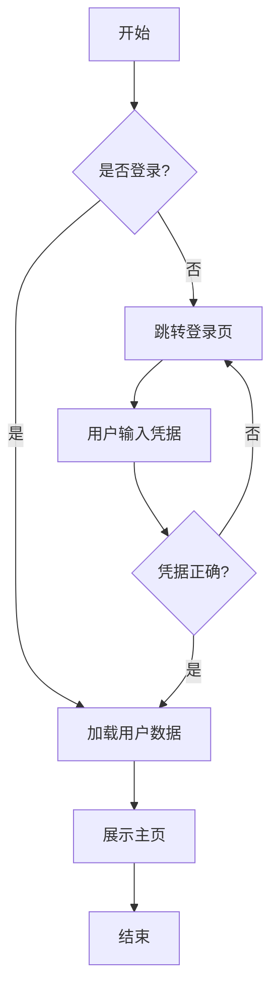
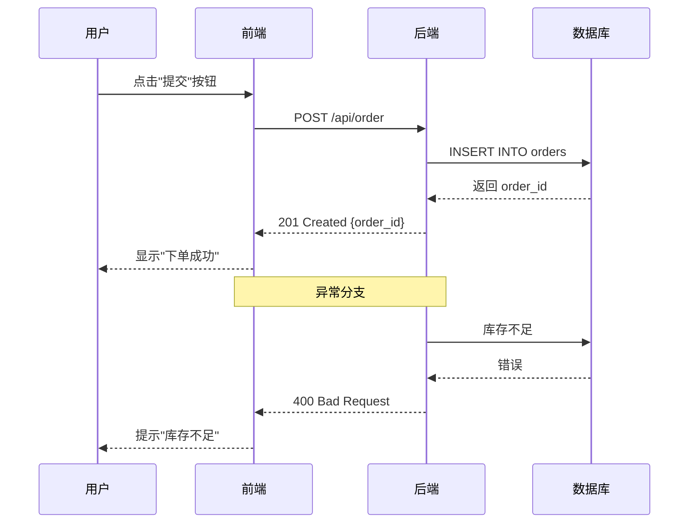
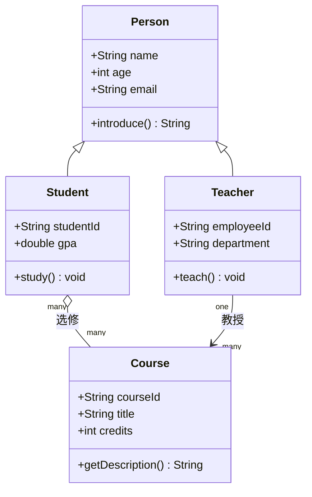
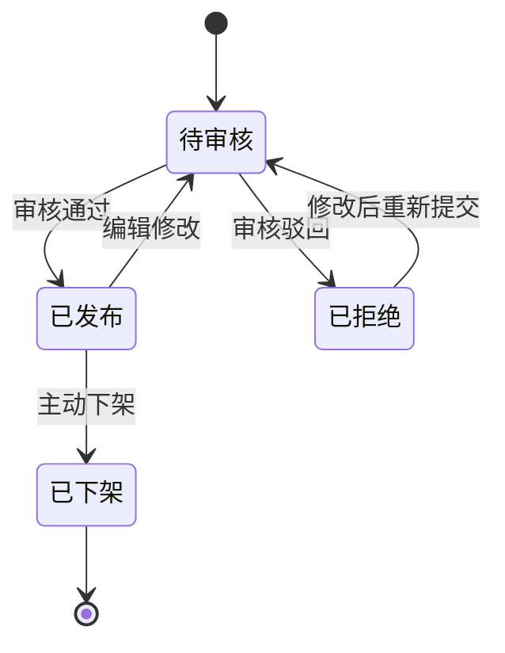
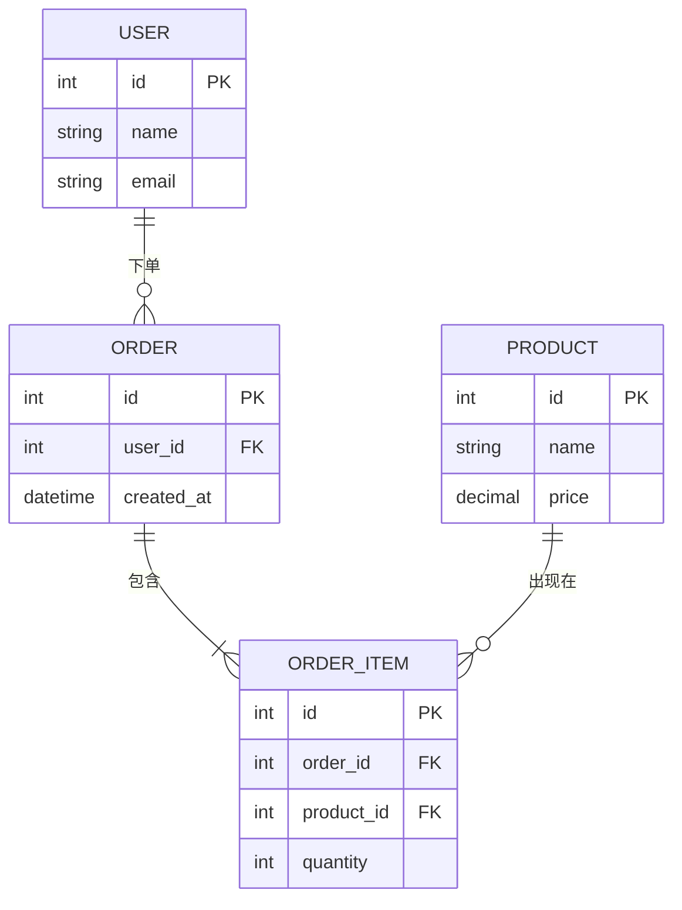
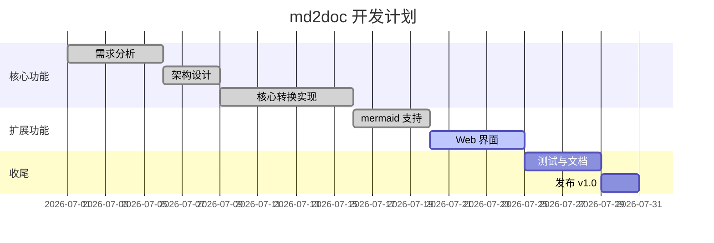
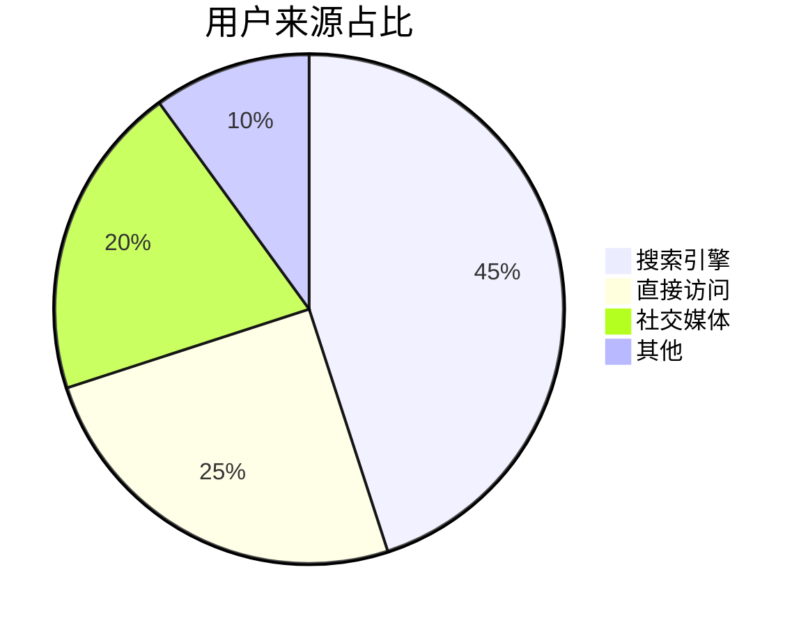
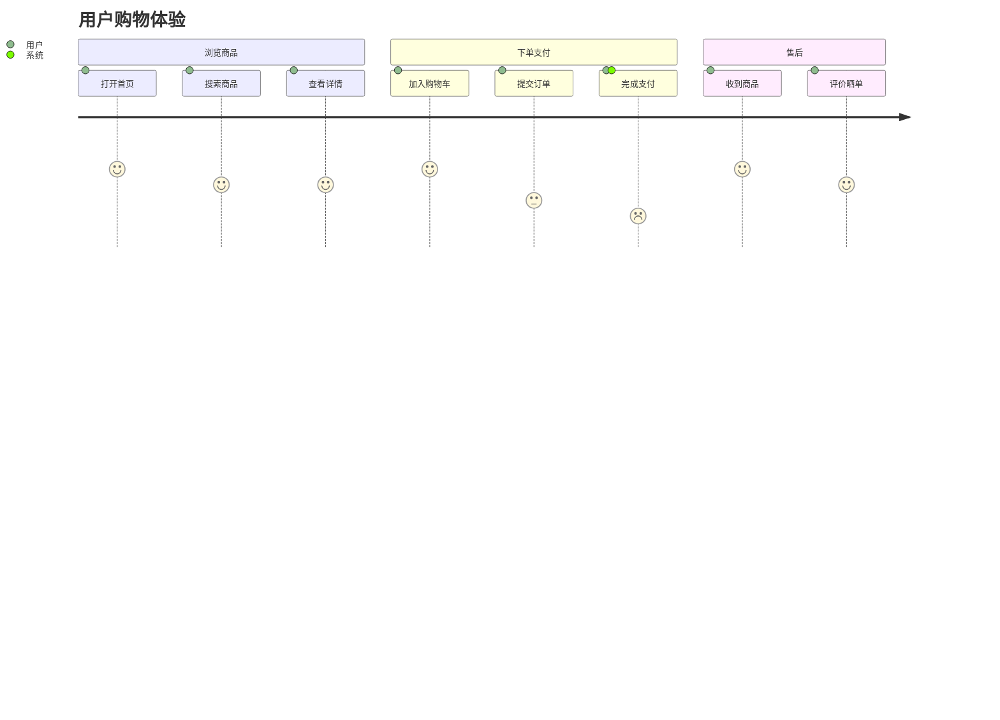
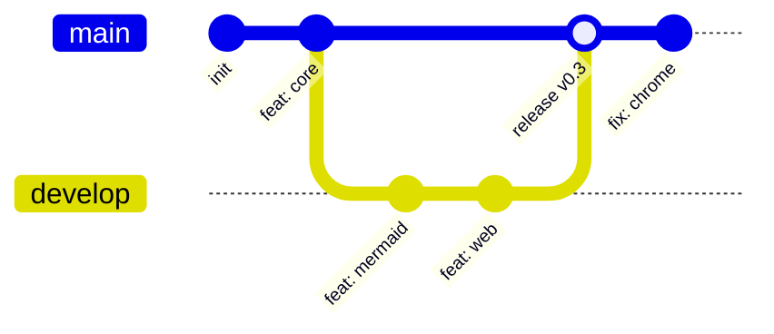

# md2doc 全面测试文档

> 本文档用于测试 md2doc 对各类 Markdown 元素 + mermaid 图 + 数学公式的转换效果。
> 生成时间：2026-08-09。

## 1. 基础文本元素

### 1.1 段落与换行

这是一个普通段落。第一句。
同一行的第二句（软换行，pandoc 默认会合并为空格）。

这是一个新段落（上方有空行）。

### 1.2 强调样式

- **粗体文本**
- *斜体文本*
- ***粗斜体***
- ~~删除线~~
- `行内代码`
- 普通**混合**文本与*样式*

### 1.3 标题层级测试

# 一级标题（文档中通常只有一个）
## 二级标题
### 三级标题
#### 四级标题
##### 五级标题
###### 六级标题

## 2. 列表

### 2.1 无序列表

- 苹果
- 香蕉
  - 帝王蕉
  - 小米蕉
- 樱桃

### 2.2 有序列表

1. 第一步：准备数据
2. 第二步：清洗数据
3. 第三步：训练模型
    1. 加载训练集
    2. 前向传播
    3. 反向传播

### 2.3 任务列表

- [x] 已完成项
- [ ] 未完成项
- [ ] 另一个待办

### 2.4 混合嵌套列表

1. 项目一
    - 子项 A
    - 子项 B
        - 更深层子项
2. 项目二
    - 子项 C

## 3. 引用

> 这是一段引用。
>
> 引用内可以有多个段落。
>
> > 嵌套引用：引用中的引用。
>
> 引用内还可以有 **粗体**、*斜体*、`代码`。

## 4. 代码

### 4.1 行内代码

使用 `pip install md2doc` 安装，运行 `md2doc input.md -o output.docx`。

### 4.2 代码块（带语法高亮标记）

```python
def fibonacci(n: int) -> int:
    """计算斐波那契数。"""
    if n <= 1:
        return n
    a, b = 0, 1
    for _ in range(n - 1):
        a, b = b, a + b
    return b


class Calculator:
    def __init__(self):
        self.history: list[int] = []

    def add(self, x: int, y: int) -> int:
        result = x + y
        self.history.append(result)
        return result
```

```bash
# 常用命令
git status
git add .
git commit -m "feat: add new feature"
```

```json
{
  "name": "md2doc",
  "version": "0.3.0",
  "dependencies": ["pandoc", "mmdc"],
  "features": ["mermaid", "math", "batch"]
}
```

### 4.4 普通代码块（无语言标记）

```
这是一段纯文本代码块。
保留所有    空格 与换行。
```

## 5. 链接与图片

### 5.1 链接

- 行内链接：[GitHub](https://github.com)
- 带标题的链接：[Google](https://google.com "搜索引擎")
- 自动链接：<https://www.python.org>
- 参考链接：[Python 官网][py]

[py]: https://www.python.org "Python"

### 5.2 URL 与邮箱

- 网址：https://example.com
- 邮箱：user@example.com

## 6. 表格

### 6.1 简单表格

| 名称 | 类型 | 必填 | 默认值 | 说明 |
|---|---|:---:|---:|---|
| name | string | 是 | - | 名称 |
| age | int | 否 | 0 | 年龄 |
| active | bool | 否 | true | 是否激活 |
| tags | list | 否 | [] | 标签列表 |

### 6.2 对齐测试

| 左对齐 | 居中对齐 | 右对齐 |
|:---|:---:|---:|
| 左 | 中 | 右 |
| AAAA | BBBB | CCCC |

### 6.3 复杂表格

| 模块 | 功能 | 状态 | 备注 |
|---|---|---|---|
| md2doc.core | 核心转换 | ✅ 完成 | - |
| md2doc.mermaid | mermaid 渲染 | ✅ 完成 | 依赖 mmdc |
| md2doc.cli | 命令行 | ✅ 完成 | rich 美化 |
| md2doc.web | Web 界面 | ✅ 完成 | FastAPI |

## 7. 数学公式（TeX）

### 7.1 行内公式

欧拉恒等式 $e^{i\pi} + 1 = 0$ 是数学中最美的等式之一。
勾股定理 $a^2 + b^2 = c^2$。

### 7.2 块级公式

二次方程求根公式：

$$
x = \frac{-b \pm \sqrt{b^2 - 4ac}}{2a}
$$

高斯积分：

$$
\int_{-\infty}^{\infty} e^{-x^2} \, dx = \sqrt{\pi}
$$

欧拉公式展开：

$$
e^{i\theta} = \cos\theta + i\sin\theta
$$

矩阵乘法：

$$
\begin{bmatrix}
a_{11} & a_{12} \\
a_{21} & a_{22}
\end{bmatrix}
\begin{bmatrix}
x_1 \\
x_2
\end{bmatrix}
=
\begin{bmatrix}
a_{11}x_1 + a_{12}x_2 \\
a_{21}x_1 + a_{22}x_2
\end{bmatrix}
$$

求和与极限：

$$
\sum_{n=1}^{\infty} \frac{1}{n^2} = \frac{\pi^2}{6}, \qquad
\lim_{x \to 0} \frac{\sin x}{x} = 1
$$

> 注意：数学公式能否正确渲染为 Word 公式取决于 pandoc 是否启用 `--mathml` 等选项；
> 默认情况下 pandoc 会将 `$...$` 转换为 Word 原生公式对象（OMML）。

## 8. 分隔线

上方内容

---

下方内容

## 9. HTML 内联

<details>
<summary>点击展开详情</summary>

这是 details 折叠块的内容。pandoc 默认可能将其转为 docx 中的提示文字。

</details>

<kbd>Ctrl</kbd> + <kbd>C</kbd> 复制，<kbd>Ctrl</kbd> + <kbd>V</kbd> 粘贴。

<sub>下标</sub> 与 <sup>上标</sup>：H<sub>2</sub>O，X<sup>2</sup>。

<span style="color: red;">红色文字</span>（docx 可能不保留内联样式）。

## 10. Mermaid 图

### 10.1 流程图（Flowchart）



### 10.2 序列图（Sequence Diagram）



### 10.3 类图（Class Diagram）



### 10.4 状态图（State Diagram）



### 10.5 实体关系图（ER Diagram）



### 10.6 甘特图（Gantt）



### 10.7 饼图（Pie）



### 10.8 用户旅程图（User Journey）



### 10.9 Git 图（Git Graph）



## 11. 边界情况测试

### 11.1 空段落（下方应该看不到内容）


### 11.2 很长的行

这是一行非常长的中文文本，没有任何换行符，用来测试 pandoc 是否能正确进行软换行处理，以及 Word 是否能根据页面宽度自动折行显示，应该不会溢出页面边界才对。

### 11.3 转义字符

\*这不是斜体\*，\`这不是代码\`，\#这不是标题，\\这是反斜杠本身。

### 11.4 Emoji 与特殊符号

- Emoji：😀 🚀 📦 ✅ ❌ ⚠️ 🎉
- 数学符号：± × ÷ ≈ ≠ ≤ ≥ ∞ ∑ ∏ ∫ √ π
- 箭头：← → ↑ ↓ ↔ ⇒ ⇔
- 中文标点：「」『』【】（）《》——……

### 11.5 连续的引用嵌套与列表混合

> 引用开始
> 1. 引用内的有序列表第一项
> 2. 第二项
>
> - 引用内的无序列表
> - 第二项
>
> 引用结束

## 12. 综合收尾

如果以上所有元素都能在生成的 docx 中正确显示：
- 标题层级清晰
- 表格对齐无误
- 数学公式渲染为 Word 公式对象
- 9 张 mermaid 图全部以 PNG 形式嵌入
- 列表/引用/代码块完整保留

那么 md2doc 的转换能力可以认为**测试通过** ✅。

---

*文档结束*
